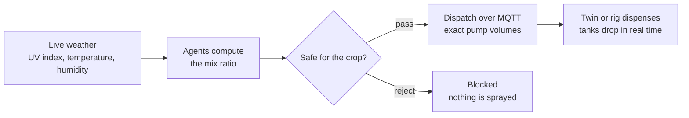
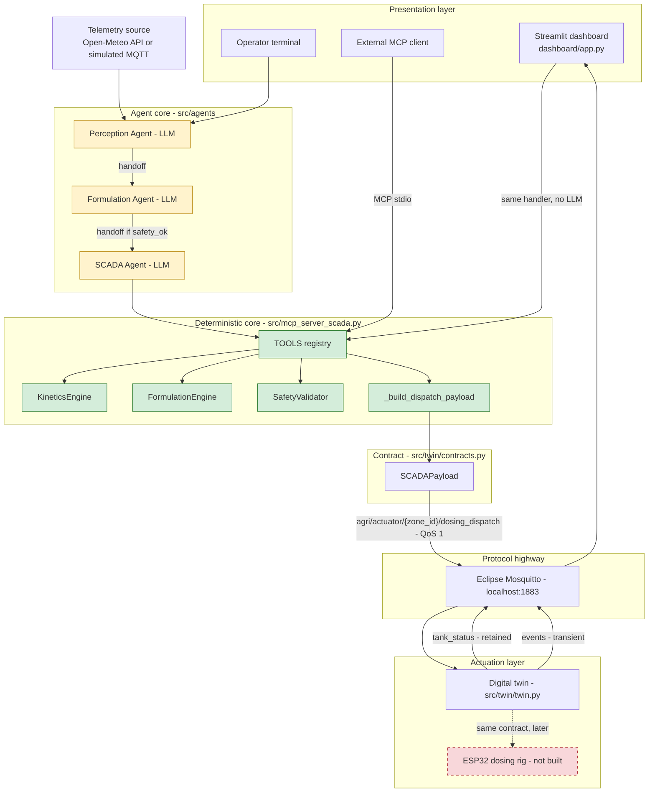
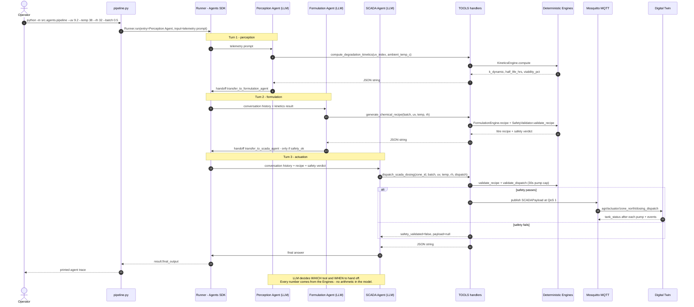
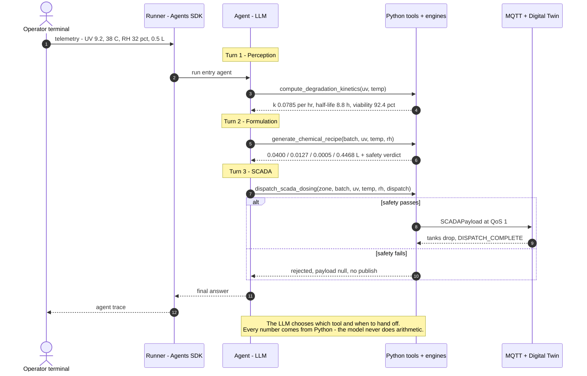
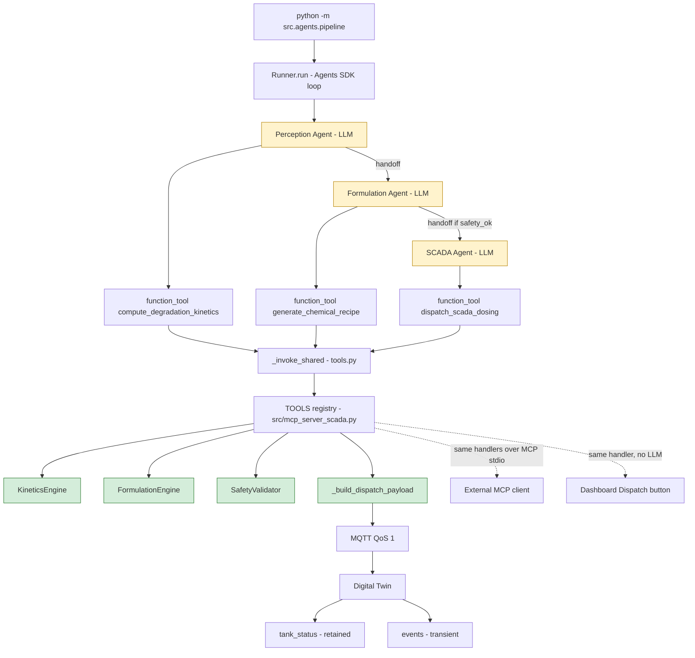
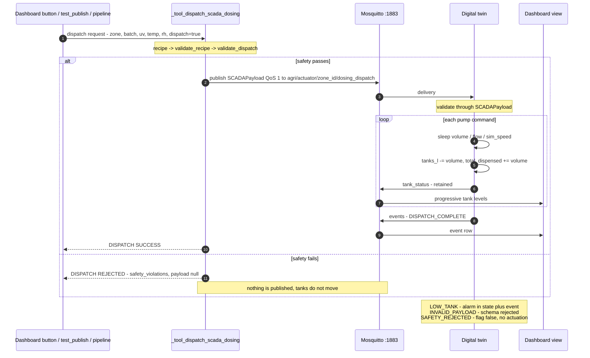
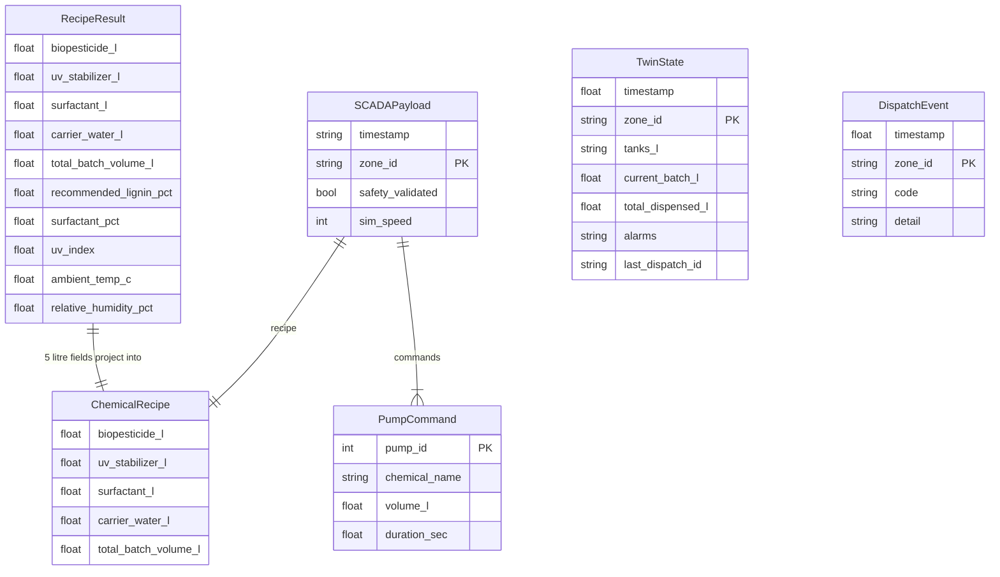
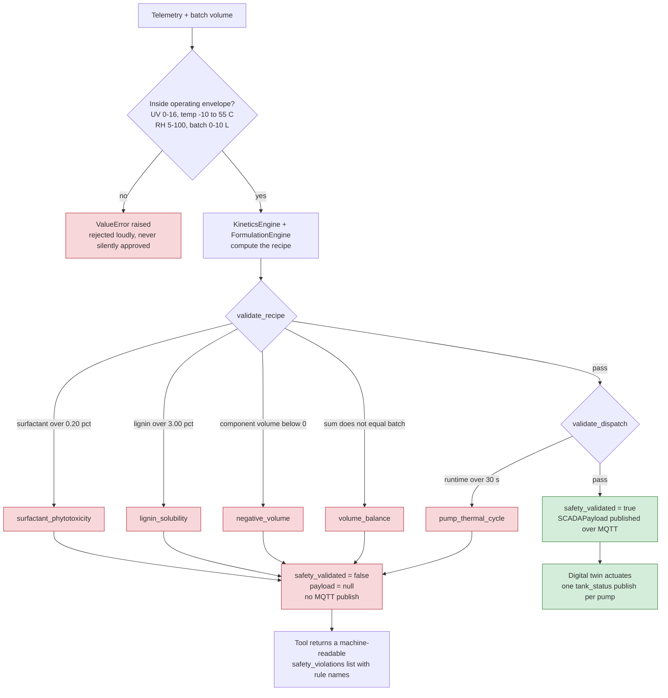

# AGRIAGENT

**Autonomous SCADA system for on-demand biopesticide formulation.**

AgriAgent reads live weather, works out how fast a biopesticide is degrading on the leaf, computes the exact mix that keeps it alive, safety-gates that mix, and dispenses it — over MQTT, to a digital twin or a physical dosing rig.

---

## Start here

Biopesticides are safe but fragile. Solar UV and heat break them down within hours, so a tank mixed at dawn is largely spent by afternoon. AgriAgent compensates: on a bright, dry day it raises the UV stabilizer and the surfactant; on a cool, humid day it backs both off. It never guesses — the chemistry is deterministic Python, and an LLM only decides *which* tool to call.



That is the whole system. Everything below is detail.

### What you can see in about 30 seconds

Run the self-test, then dispatch a 0.5 L batch for a harsh midday (`UV 9.2, 38 °C, 32 % RH`):

| Step | Result |
| --- | --- |
| Degradation rate | `k = 0.0785 /hr` → half-life `8.83 h` |
| Recipe | biopesticide `0.04000 L`, UV stabilizer `0.01275 L`, surfactant `0.00050 L`, water `0.44675 L` |
| Safety | passes; volumes sum to exactly `0.5 L` |
| Pump runtimes | `4.000 s`, `1.275 s`, `0.050 s`, `8.935 s` (0.01/0.01/0.01/0.05 L/s) |
| Twin | dispenses each pump in turn, publishing tank state after **every** pump |

Then set the batch to 10 L and watch the dispatch button disable itself: `pump 1 runtime 80.0s exceeds 30s threshold; pump 4 runtime 178.7s exceeds 30s threshold`. The system refusing a request is as important as it accepting one.

## The problem it solves

**The core problem.** A biopesticide's active ingredient is destroyed by exactly the conditions that make it useful — sunlight and heat. Its field half-life (DT50) collapses to hours, so a fixed, pre-mixed tank is wrong the moment the weather changes. Farmers compensate by spraying more often, which raises cost and defeats the point of using a biological agent.

**Why a fixed ratio cannot work.** The required stabilizer dose is a function of UV index. Across a single day the model swings this sharply:

| Condition | UV | Temp | RH | Half-life | Stabilizer dose | Surfactant dose |
| --- | --- | --- | --- | --- | --- | --- |
| Bright dry midday | 9.2 | 38 °C | 32 % | **8.83 h** | **2.550 %** | 0.0993 % |
| Overcast morning | 2.1 | 24 °C | 75 % | **36.90 h** | **0.775 %** | 0.0663 % |
| Night | 0.0 | 18 °C | 85 % | **72.49 h** | **0.250 %** | 0.0584 % |

A single fixed blend is either under-dosed at midday (the active ingredient dies) or over-dosed at night (wasted stabilizer, needless cost). An 8× swing in half-life and a 10× swing in required stabilizer cannot be met by one recipe.

**What is at stake commercially.** In South Asian export agriculture, residue limits and input costs are the binding constraints — the EU cut the tricyclazole MRL for Basmati rice to `0.01 mg/kg`, and cotton growers report up to `PKR 50,000` per acre on synthetic sprays. The project's target is a **90 % reduction in applied synthetic volume**, roughly `PKR 45,000` per acre. **Treat those as literature-backed targets and cost-model estimates, not measured results of this build** — see [Honest limits](#honest-limits).

**What AgriAgent does about it.** It makes the ratio a live decision instead of a fixed one: measure the weather, compute the degradation rate, dose the stabilizer to match, validate that the result is safe for the crop, then dispense it automatically over an industrial protocol. One decision, made correctly, every cycle.

## How it works

### The four agents

1. **Perception Agent** — ingests weather telemetry, validates ranges, computes the degradation half-life.
2. **Formulation Agent** — computes exact litre setpoints for biopesticide, UV stabilizer (sodium lignosulfonate), surfactant, and carrier water, then hands off only if the recipe is safe.
3. **Safety Agent** — the guardrail. Rejects phytotoxic or mechanically infeasible recipes with machine-readable rule names.
4. **SCADA / Actuator Agent** — converts volumes to pump runtimes and publishes the JSON payload over MQTT.

The LLM agents are thin parsers: they choose *which tool* to call and *when to hand off*. **Every number comes from Python.** See [Diagram 3](#3-agent-runtime--how-the-agent-works) for the full runtime trace.

### The chemistry is deterministic, not LLM-guessed

All volumes are SI litres (L); pump flows are L/s. Constants: `k₀ = ln(2)/48`, `Ea = 42.5 kJ/mol`, `α = 0.18`.

- **Kinetics** — `C(t) = C₀·e^(−k·t)` with `k = k₀·(1+α·UV)·e^(−(Ea/R)(1/T − 1/T₀))`. Arrhenius thermal + UV photolysis, per-hour units.
- **UV stabilizer** — `C_lignin = min(3.0 %, 0.25 % + 0.25 %·UV)`, capped at the solubility limit to prevent nozzle clogging.
- **Surfactant** — `min(0.20 %, 0.05 %·(1 + 1.2·(1 − RH/100))·(T_K/293.15)^1.5)`, capped to prevent phytotoxicity.
- **Active concentrate** — fixed 8 % v/v of batch; carrier water balances the remainder.
- **Pump calibration** — `0.01` L/s (pumps 1–3), `0.05` L/s (carrier water); runtime is always computed from `volume ÷ flow`, never accepted from a caller.

The engines are pure standard-library math with zero third-party dependencies, and `src/mcp_server_scada.py --selftest` is the gate that proves it.

## The stack

| Layer | Technology | Version | Why |
| --- | --- | --- | --- |
| Language | Python | 3.14.7 | One language across agents, engines, twin, and dashboard |
| Deterministic core | Standard library only | — | Zero-dependency math that runs and tests anywhere |
| Validation | Pydantic | 2.13.5 | Strict schemas on every tool and payload boundary |
| Agent runtime | openai-agents | 0.22.3 | `Agent`, `Runner`, `function_tool`, native `handoffs` |
| Secrets | python-dotenv | 1.2.4 | `OPENAI_API_KEY` loaded from a repo-root `.env` |
| Tool protocol | MCP (Model Context Protocol) SDK | 2.2.0 | The same three tools exposed over stdio to any MCP client |
| Messaging | paho-mqtt | 2.1.0 | MQTT client for dispatch and state |
| Broker | Eclipse Mosquitto | 2.1.2 | Local pub/sub; standard industrial topic hierarchy |
| Dashboard | Streamlit | 1.64.0 | Live state and an explicit dispatch control |
| Charts | pandas | 3.0.6 | Tank-level dataframes |
| Tests | pytest + pytest-asyncio | 9.1.1 / 1.4.0 | SDK pipeline tests run without an API key, via `ScriptedModel` |
| Docs tooling | Node + `@mermaid-js/mermaid-cli` + Chromium | Node 26.7.0 | Renders `docs/diagrams/*.mmd` to SVG/PNG and builds the interactive gallery |

Declared dependencies live in [`specs/code/requirements.txt`](specs/code/requirements.txt). The kinetics dataset pipeline is deliberately pure standard library.

## Real-world scenarios

### Where the decision actually changes

The table in [The problem it solves](#the-problem-it-solves) is the whole argument: the same telemetry that says "spray now" at `UV 2.1` requires ten times more stabilizer at `UV 9.2`. A static premix cannot express that difference; a live computation can.

### When the request is unsafe

The guardrails are not decorative — they are the part that makes unattended dosing acceptable:

| Trigger | Response |
| --- | --- |
| Surfactant above 0.20 % v/v | `surfactant_phytotoxicity` — rejected, nothing published |
| Stabilizer above 3.00 % w/v | `lignin_solubility` — rejected (nozzle clogging) |
| Any component volume negative | `negative_volume` — rejected |
| Components do not sum to batch | `volume_balance` — rejected |
| Pump runtime above 30 s | `pump_thermal_cycle` — rejected (pump overheating) |
| Telemetry outside the envelope | `ValueError` — rejected loudly, never silently approved |

A rejected recipe returns `safety_validated: false` with a machine-readable `safety_violations` list, and **no payload is published**. In the dashboard the dispatch button disables itself before you can try.

### In the field, mid-dispatch

- A tank runs short → the twin raises a `LOW_TANK` alarm in the published state and emits a `LOW_TANK` event. It never silently skips a pump.
- A malformed payload arrives → `INVALID_PAYLOAD` event with the validation error.
- A payload arrives with `safety_validated: false` → `SAFETY_REJECTED`, no actuation.
- The broker is down → dispatch returns `{"published": false, "error": ...}` rather than pretending to succeed.

State is published after **every** pump, so tank levels are observable as they fall rather than only at the end.

### How it would be deployed

The actuation interface is a standard MQTT topic hierarchy, so the software path bolts onto existing SCADA infrastructure without replacing hardware. Two surfaces consume the same logic:

- **MCP over stdio** — any MCP-capable agent can call the three tools directly.
- **MQTT dispatch** — the payload contract in `src/twin/contracts.py` is the single source of truth, and the twin or a rig subscribes to it.

The physical ESP32 rig is **not built**; the digital twin is the demo target and the firmware would inherit the same contract.

### Honest limits

- The figures above are computed by this repository's engines and are reproducible — run the self-test and the scenario script.
- The **90 % volume reduction**, **PKR 45,000/acre**, and the **7–14× half-life extension from lignin encapsulation** are literature-derived targets and cost-model estimates. They are not measurements produced by this build. Present them as targets, with sources.
- The twin models **timed pump actuation and tank depletion**. It is not a hydraulic simulation; do not describe it as fluid mechanics.
- The unstabilized degradation constant is modelled. The *stabilized* half-life is not — extending that would be a spec change first.

## Diagrams

Eight Mermaid diagrams, all rendered from `docs/diagrams/*.mmd`. For **zoom and pan**, open [`docs/diagrams/interactive.html`](docs/diagrams/interactive.html) in a browser — it is fully offline (no CDN, no server) and every diagram there supports scroll-to-zoom, drag-to-pan, and double-click-to-zoom.

> GitHub renders the static version below. The interactive page is local-only, because GitHub sanitises scripts.

### 1. Overview

Repeated from [Start here](#start-here) so that this section holds the complete set. The whole idea in one line.


### 2. System architecture

The system in layers: presentation → agent core → deterministic core → contract → MQTT → actuation. Red dashed is not built.



### 3. Agent runtime — how the agent works

The full `Runner` loop: three turns, every tool call, the conditional handoff, and the safety branch. The note at the bottom is the point of the whole design.



The same story compressed to five lifelines for projecting:



### 4. Agent composition

Structure rather than sequence: agents → `@function_tool` wrappers → the shared handler registry → the engines. Yellow is LLM, green is deterministic. Note that the MCP client and the dashboard button hang off the *same* registry.



### 5. Dispatch lifecycle

Data flow of one dispatch: request → safety gate → MQTT → twin validation → per-pump tank state → events → dashboard.



### 6. Data model (ERD)

There is **no database** in this project, so this is not an ERD over tables — it is the data model of the MQTT contract plus the engine outputs, i.e. the payloads every layer shares. `RecipeResult` (engine output) projects its five litre fields into `ChemicalRecipe` (the contract).



Constraints the diagram cannot express: `chemical_name` is one of `biopesticide` / `uv_stabilizer` / `surfactant` / `carrier_water`; `pump_id` is 1–4; `DispatchEvent.code` is one of `SAFETY_REJECTED` / `INVALID_PAYLOAD` / `LOW_TANK` / `DISPATCH_COMPLETE`. Note that `PumpCommand` carries **no** `flow_rate_l_per_sec` — the twin is authoritative for runtimes and recomputes them from its own calibrated table.

### 7. Safety gate

Every guardrail and where each verdict exits.



### Regenerating the diagrams

```bash
docs/diagrams/render.sh            # render SVG + PNG, rebuild interactive.html, check the README embeds
docs/diagrams/render.sh --no-render  # gallery and README check only
```

The `.mmd` files are the source of truth. `render.sh` re-renders every diagram, rebuilds `interactive.html`, and **fails if any `.mmd` is not embedded verbatim in this README** — so the two cannot silently drift apart. See [`docs/diagrams/README.md`](docs/diagrams/README.md) for per-diagram notes.

## What's built

- **`src/mcp_server_scada.py`** — the MCP SCADA tool server. Three tools (`compute_degradation_kinetics`, `generate_chemical_recipe`, `dispatch_scada_dosing`) with Pydantic-validated schemas, the confirmed formulas, and the safety guardrail. `--selftest` (21 checks) or `--demo`; serves over MCP stdio.
- **`src/agents/`** — the OpenAI Agents SDK pipeline: Perception → Formulation → SCADA with native handoffs, driven by `Runner.run(...)`. Secrets load from the repo-root `.env`. `python -m src.agents.pipeline`.
- **`src/twin/`** — the shared contract (`contracts.py`) and the digital twin (`twin.py`): subscribes to dispatch, publishes tank state after every pump, emits events.
- **`dashboard/app.py`** — Streamlit dashboard with a live tank panel and a dispatch button that disables itself when the recipe fails safety.
- **`specs/code/kinetics_pipeline.py`** — fetches real hourly weather (Open-Meteo) and exports a Kaggle-ready degradation dataset. Pure standard library.
- **`specs/code/scada_trajectory_pipeline.py`** — generates 500 synthetic formulation + MQTT actuation traces.
- **Two datasets** — `data/synthetic_biopesticide_telemetry.csv` and `data/agriagent_scada_dosing_trajectories.csv`.

**Not built:** the physical ESP32 dosing rig. The digital twin is the demo target; firmware would inherit the same MQTT contract.

## Repository layout

```
src/            MCP SCADA server + agent pipeline (agents/, twin/)
dashboard/      Streamlit SCADA interface
specs/          Specs by kind: scope/, design/, data/, code/
data/           Generated datasets (kinetics + SCADA trajectories)
docs/           Wayfinding map, ADRs, and diagrams/ (all Mermaid sources + gallery)
scripts/        Utility scripts (telemetry sim, demo helpers)
tests/          Agent pipeline tests (no API key required)
```

## Getting started

```bash
# 1. Install dependencies
python3 -m venv .venv && .venv/bin/pip install -r specs/code/requirements.txt

# 2. Configure secrets — the runner loads OPENAI_API_KEY from the repo-root .env
cp .env.example .env    # then paste your key

# 3. Prove the chemistry (pure math, no broker, no API key)
.venv/bin/python src/mcp_server_scada.py --selftest

# 4. Run the agent pipeline (omit --dispatch to preview)
.venv/bin/python -m src.agents.pipeline --zone zone_north --uv 9.2 --temp 38 --rh 32 --batch 0.5

# 5. Live demo: broker, twin, and dashboard in three terminals
mosquitto -p 1883
.venv/bin/python -m src.twin.twin
.venv/bin/streamlit run dashboard/app.py
# then open http://localhost:8501 and press "Dispatch now"

# 6. Tests
.venv/bin/python -m pytest tests/ -q

# 7. Datasets (kinetics needs network; --offline for deterministic synthetic telemetry)
.venv/bin/python specs/code/kinetics_pipeline.py --days 7 --output data/synthetic_biopesticide_telemetry.csv
.venv/bin/python specs/code/kinetics_pipeline.py --offline --days 2
.venv/bin/python specs/code/scada_trajectory_pipeline.py --runs 500 --output data/agriagent_scada_dosing_trajectories.csv

# 8. Diagrams (needs Chromium)
docs/diagrams/render.sh
```

Steps 1–7 need no API key except step 4, and step 3 needs no broker.

## Canonical MQTT topics

- Telemetry in: `agri/telemetry/{zone_id}/environment`
- Actuate: `agri/actuator/{zone_id}/dosing_dispatch` (QoS 1)
- State feedback: `agri/digital_twin/{zone_id}/tank_status` (retained)
- Events: `agri/digital_twin/{zone_id}/events` (transient)

## Documentation map

| Path | Contents |
| --- | --- |
| [`specs/mvp-build-spec.md`](specs/mvp-build-spec.md) | The buildable spec — functional requirements and acceptance criteria. The source of truth for behaviour. |
| [`specs/scope/hackthon-scope.md`](specs/scope/hackthon-scope.md) | Scope, the four-agent architecture, formulas, MQTT contracts. |
| [`specs/design/design-and-implementation.md`](specs/design/design-and-implementation.md) | The science, market analysis, hardware design, and the stage pitch. |
| [`specs/data/`](specs/data) | Dataset schemas and Kaggle publishing metadata. |
| [`docs/diagrams/`](docs/diagrams) | All Mermaid sources, rendered SVG/PNG, and the interactive gallery. |
| [`AGENTS.md`](AGENTS.md) | Working agreement: the demo north star and the project constitution. |

## Roadmap

The build is charted on the wayfinder map (GitHub Issues #1) — decision tickets covering the digital twin contract, the agent runtime, and the demo dashboard. Broker choice, pump calibration, formulation policy, and the kinetics constants are settled. Known open items: the `flow_rate_l_per_sec` gap between `PumpCommand` and the design spec, per-zone tank state in the twin (currently one shared dict), and a startup republish so a restarted twin cannot serve stale retained levels.

## License

MIT (pending — see tickets).
